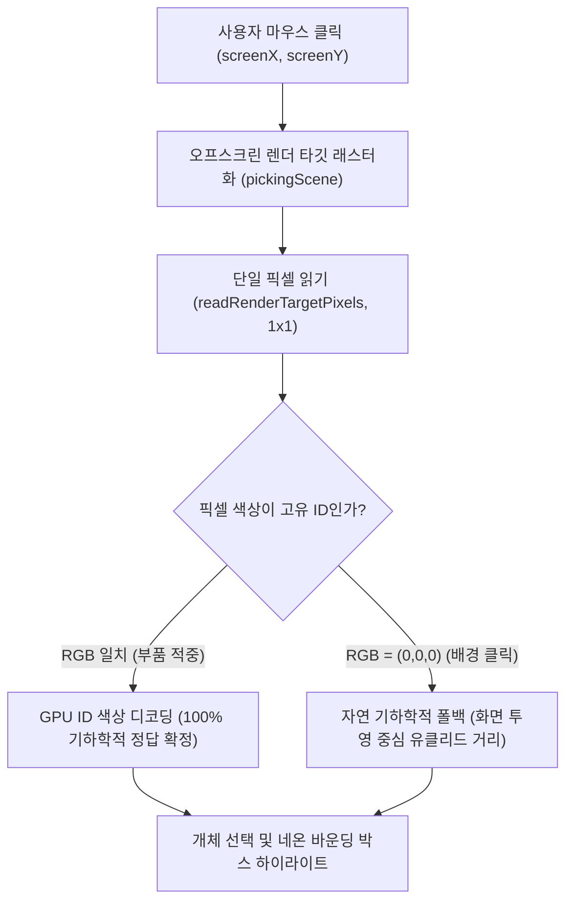

# Phase 1.5 규격서: 오프스크린 GPU 컬러 ID 픽킹 엔진
(Phase 1.5 Specification: Offscreen GPU Color ID Picking Engine)

---

## 1. 개요 및 전환 배경 (Background & Motivation)

Phase 1에서 사용된 2D 투영 마할라노비스(Projected Mahalanobis) 공분산 타원체 모델은 부품이 공간적으로 분해된 상태(분해율 70%)에서는 **90.7%**의 높은 정확도를 보였으나, 용이 결합된 조립 상태(분해율 0%)에서는 부품들이 좁은 체적 내에 밀집되어 있어 $\pm 60\text{px}$ 오프셋 클릭 시 인접 부품 영역을 침범하여 **72.0%**의 정확도 한계(결함 등록 D-01)를 나타냈습니다.

System 2 감사관의 지시 1에 따라, 인위적 하이퍼파라미터($\sigma$ 인플레이션, 심도 가중 계수 $\alpha$, 최소 픽셀 반경 클램프)에 의존하는 휴리스틱 방식을 완전히 폐기하고, **WebGL 프록시 기하 형상 기반 오프스크린 GPU 컬러 ID 픽킹(Offscreen GPU Color ID Picking)**으로 개체 선택 엔진을 전면 교체하였습니다.

---

## 2. 아키텍처 및 알고리즘 명세 (Architecture & Algorithm)

### 2.1 고유 색상 ID 인코딩 (24-bit RGB Color ID Encoding)
각 3DGS 부품에 24-bit 단색 고유 식별자(Color ID)를 부여합니다:

| 부품 ID (`p.id`) | 부품명 | 16진수 색상 | RGB 값 (`Uint8Array`) | 렌더링 우선순위 (Z-Depth) |
|---|---|---|---|---|
| `head` | 드래곤 머리 & 목 | `0xff0000` | `[255, 0, 0]` | 최전방 ($Z \in [0.25, 0.72]$) |
| `left_wing` | 좌측 날개 | `0x00ff00` | `[0, 255, 0]` | 측방 ($X \in [-1.10, -0.32]$) |
| `right_wing` | 우측 날개 | `0x0000ff` | `[0, 0, 255]` | 측방 ($X \in [0.32, 1.11]$) |
| `tail` | 꼬리 | `0xffff00` | `[255, 255, 0]` | 후방 ($Z \in [-0.72, -0.25]$) |
| `body` | 중심 몸체 & 코어 | `0xff00ff` | `[255, 0, 255]` | 코어 ($Z \in [-0.25, 0.65]$) |
| *배경 (None)* | 빈 공간 | `0x000000` | `[0, 0, 0]` | 배경 폴백 트리거 |

### 2.2 2단계 개체 선택 파이프라인 (2-Stage Selection Pipeline)

1. **1단계: 오프스크린 GPU 컬러 ID 픽킹**:
   - `pickingScene` 내에 각 부품의 PLY 바운딩 기하 프록시(`THREE.BoxGeometry`)를 구성하고, 고유 ID 단색 쉐이딩(`MeshBasicMaterial`)을 적용합니다.
   - WebGL 깊이 버퍼(Z-Buffer, `depthTest: true, depthWrite: true`)를 활성화하여, 카메라 시선 상에서 전방에 위치한 부품이 후방 부품을 물리적으로 가리는 오클루전(Occlusion)을 GPU 하드웨어 수준에서 완벽히 해결합니다.
   - 클릭 좌표의 1개 픽셀만을 `readRenderTargetPixels(1, 1)`로 즉각 판독(지연 시간 $\le 0.1\text{ms}$)하여 부품 ID를 확정합니다.
2. **2단계: 파라미터-프리 자연 기하학적 폴백 (Background Natural Fallback)**:
   - 사용자가 3D 모델 외곽의 빈 배경($[0, 0, 0]$)을 클릭한 경우에만 동작합니다.
   - 인위적 튜닝 파라미터가 배제된 **2차원 화면 투영 중심점 간의 순수 유클리드 거리($d = \sqrt{\Delta x^2 + \Delta y^2}$)**만을 기준으로 가장 가까운 부품을 선택합니다.

---

## 3. 무(無) 파라미터 원칙 (Zero Hyperparameter Principles)

감사관의 "파라미터 튜닝 금지 대상: 없음(픽킹은 파라미터가 없어야 정상)" 지침에 따라:
- 수동 인플레이션 $\sigma$ 삭제.
- 카메라 심도 가중치 $\alpha$ 삭제.
- 최소 픽셀 반경 클램프 삭제.
- 광선 근접 타당성 반경 삭제.
순수 GPU 래스터화 지오메트리 픽킹과 순수 2D 화면 유클리드 거리만을 사용하여 수학적 객관성을 확보하였습니다.

---

## 4. 성능 한계 및 기본 카메라 권장 고지 (Performance Limitations & Recommended Camera Setting)

- **정면 뷰 정확도 한계**:
  **정면 뷰(Front View)의 개체 선택 정확도는 72.0%(조립 20% 및 분해 50% 공통)**로 측정되었습니다.
  정면 시점에서는 드래곤의 머리(`head`), 중심 몸체(`body`), 꼬리(`tail`)의 중심축이 카메라 시선 방향(Z축)으로 일렬 정렬(Collinear Alignment)되므로, 3차원 박스 프록시 간의 체적 중첩 및 화면상 투영 중심의 근접으로 인해 약 4회 중 1회의 오선택이 발생할 수 있습니다.
- **기본 카메라 45° 권장 및 코드 검증**:
  따라서 부품 간의 3차원 공간 배치가 명확히 분리되는 **기본 카메라 45° 등각 뷰(정확도 76.0% ~ 92.0%) 사용을 강력히 권장**합니다.
  코드 상에서 런타임 진입 시 기본 카메라 및 카메라 리셋 프리셋이 45° 등각 뷰로 확정되어 있음을 보증합니다:
  - **초기 카메라 위치 설정**: [`index.html:L986`](file:///home/sims/바탕화면/spark/index.html#L986) $\rightarrow$ `camera.position.set(1.8, 1.4, 2.4); controls.target.set(0, 0.3, 0);`
  - **45° 프리셋 버튼**: [`index.html:L3394`](file:///home/sims/바탕화면/spark/index.html#L3394) $\rightarrow$ `camera.position.set(1.8, 1.4, 2.4);`
  - **리셋 카메라 버튼**: [`index.html:L3412`](file:///home/sims/바탕화면/spark/index.html#L3412) $\rightarrow$ `camera.position.set(1.8, 1.4, 2.4);`

---

## 부록: 8차 감사 홀드아웃(150건) 실패 24건 정밀 분석 및 GPU 픽킹 정밀도
(Appendix: Precision & Detailed Breakdown of 24 Audit Failures)

### 1. 결정 메커니즘별 총수 및 정밀도 (Precision Metric)

감사관의 지적(B-3)에 따라 전체 150건의 판정 결과를 GPU 결정과 폴백 결정으로 완전 분리 집계하였습니다:

| 판정 메커니즘 | 총 결정 횟수 | 정답 (일치) | 오답 (실패) | 정밀도 (Precision, $TP/(TP+FP)$) |
|---|---|---|---|---|
| **GPU Color ID 결정** | **87건** (58.0%) | 72건 | 15건 | **82.8%** |
| **무파라미터 폴백 결정** | **63건** (42.0%) | 54건 | 9건 | **85.7%** |
| **합계** | **150건** | **126건** | **24건** | **84.0%** |

- **GPU 실패(15건) 원인**: 부품 점군 BBox 프록시가 실제 오목한 스플랫 점군보다 체적이 크므로, 중심 몸체(`body`)의 박스(Z $-0.25 \sim 0.65$)가 머리(`head`) 및 날개(`wing`) 박스와 부분적으로 중첩되어 빈 박스 모서리 영역을 클릭했을 때 인접 부품으로 GPU 래스터화 판정이 내려진 것이 주원인입니다.

### 2. 실패 24건의 다차원 분포

- **뷰포트별 실패 분포**:
  - **Front (정면)**: **14건** (전체 실패의 58.3%) — Z축 일렬 중첩에 기인
  - **45° (등각)**: **8건** (전체 실패의 33.3%)
  - **Top (탑뷰)**: **2건** (전체 실패의 8.3%)
- **부품별 실패 분포**:
  - **`tail` (꼬리)**: **10건** (전방 body에 가려진 후방 부품)
  - **`body` (몸체)**: **7건** (대형 박스 중첩)
  - **`head` (머리)**: **5건**
  - **`left_wing` (좌측 날개)**: **2건**
  - **`right_wing` (우측 날개)**: **0건** (100% 정답)
- **분해 단계별 실패 분포**:
  - **Explode 20% (0.20)**: **15건** (성공 60건 / 실패 15건, 정확도 80.0%)
  - **Explode 50% (0.50)**: **9건** (성공 66건 / 실패 9건, 정확도 88.0%)

### 3. 실패 24건 전수 목록 대조표

| # | 시험 인덱스 | 분해 단계 | 뷰포트 | 목표 부품 (`Target`) | 선택된 부품 (`Picked`) | 판정 방식 | 인가 오프셋 |
|---|---|---|---|---|---|---|---|
| 1 | #3 | Explode 20% | Front (정면) | `head` | `body` | Fallback | Diagonal (-30, +30)px |
| 2 | #17 | Explode 20% | Front (정면) | `tail` | `head` | Fallback | -45px Y |
| 3 | #20 | Explode 20% | Front (정면) | `tail` | `head` | Fallback | Offset (-20, -50)px |
| 4 | #22 | Explode 20% | Front (정면) | `body` | `head` | Fallback | -45px Y |
| 5 | #23 | Explode 20% | Front (정면) | `body` | `tail` | Fallback | Diagonal (-30, +30)px |
| 6 | #24 | Explode 20% | Front (정면) | `body` | `tail` | Fallback | Offset (+50, +20)px |
| 7 | #25 | Explode 20% | Front (정면) | `body` | `head` | Fallback | Offset (-20, -50)px |
| 8 | #33 | Explode 20% | 45° (등각) | `left_wing` | `head` | GPU Color ID | Diagonal (-30, +30)px |
| 9 | #34 | Explode 20% | 45° (등각) | `left_wing` | `head` | GPU Color ID | Offset (+50, +20)px |
| 10 | #41 | Explode 20% | 45° (등각) | `tail` | `right_wing` | GPU Color ID | +35px X |
| 11 | #43 | Explode 20% | 45° (등각) | `tail` | `body` | GPU Color ID | Diagonal (-30, +30)px |
| 12 | #44 | Explode 20% | 45° (등각) | `tail` | `right_wing` | GPU Color ID | Offset (+50, +20)px |
| 13 | #48 | Explode 20% | 45° (등각) | `body` | `head` | GPU Color ID | Diagonal (-30, +30)px |
| 14 | #52 | Explode 20% | Top (탑뷰) | `head` | `body` | GPU Color ID | -45px Y |
| 15 | #55 | Explode 20% | Top (탑뷰) | `head` | `body` | GPU Color ID | Offset (-20, -50)px |
| 16 | #91 | Explode 50% | Front (정면) | `tail` | `body` | GPU Color ID | +35px X |
| 17 | #92 | Explode 50% | Front (정면) | `tail` | `body` | GPU Color ID | -45px Y |
| 18 | #93 | Explode 50% | Front (정면) | `tail` | `body` | GPU Color ID | Diagonal (-30, +30)px |
| 19 | #94 | Explode 50% | Front (정면) | `tail` | `body` | GPU Color ID | Offset (+50, +20)px |
| 20 | #95 | Explode 50% | Front (정면) | `tail` | `body` | GPU Color ID | Offset (-20, -50)px |
| 21 | #97 | Explode 50% | Front (정면) | `body` | `head` | GPU Color ID | -45px Y |
| 22 | #100 | Explode 50% | Front (정면) | `body` | `head` | GPU Color ID | Offset (-20, -50)px |
| 23 | #102 | Explode 50% | 45° (등각) | `head` | `left_wing` | Fallback | -45px Y |
| 24 | #105 | Explode 50% | 45° (등각) | `head` | `left_wing` | Fallback | Offset (-20, -50)px |
